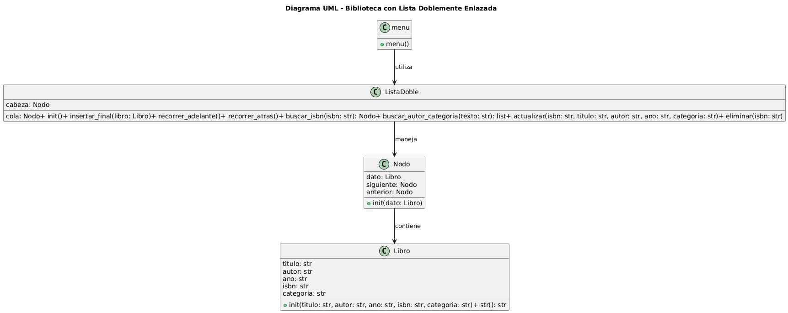

# Sistema de Gestión de Biblioteca (Lista Doble Enlazada)

Este proyecto es una aplicación web diseñada para gestionar un inventario de libros utilizando una estructura de datos de **Lista Doblemente Enlazada**. Desarrollado como parte de la **Práctica Unidad I**.

## Integrantes del Equipo
*   **Ceja Cervantes Alejandro**
*   **Covarrubias Martinez Hector**
*   **Escobar Rubio Dominic**

## Tecnologías Utilizadas
*   **Backend**: [FastAPI](https://fastapi.tiangolo.com/) (Python 3.10+)
*   **Servidor**: [Uvicorn](https://www.uvicorn.org/)
*   **Frontend**: HTML5, CSS3 , JavaScript 
*   **Estándares**: PEP 8 para el código Python

## Estructura del Proyecto
*   `main.py`: Servidor API y lógica de la Lista Doblemente Enlazada.
*   `static/`: Archivos del frontend.
    *   `index.html`: Estructura y carrusel de nodos.
    *   `style.css`: Estética y animaciones.
    *   `script.js`: Interactividad y consumo de API.

## Instalación y Ejecución

1.  **Clonar el repositorio**:
    ```bash
    git clone https://github.com/HectorCM2220/PracticaUnidadI.git
    cd PracticaUnidadI
    ```

2.  **Instalar dependencias**:
    ```bash
    pip install fastapi uvicorn
    ```

3.  **Iniciar el sistema**:
    ```bash
    python -m uvicorn main.py:app --reload
    ```

4.  **Acceder**:
    Abre [http://localhost:8000](http://localhost:8000) en tu navegador.
    
## 📐 Arquitectura del Sistema (UML)


